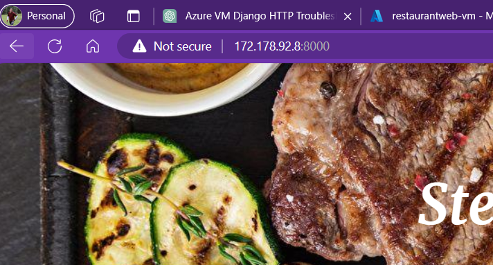
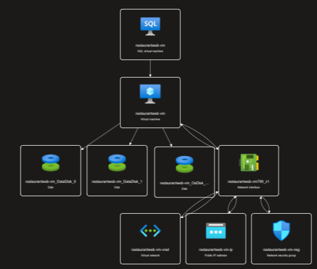

# Deploying the VM on Azure
In this assignment, you are going to deploy a virtual machine on Azure and set up a web server with a database. The web server will be running a Django application and the database will be running SQL Server.  This is an example of Infrastructure as a Service (IaaS) deployment, because we are going to take responsibility for the operating system and the software running on it, including the web server and the database.  In subsequent assignments, we will look at Platform as a Service (PaaS) deployments, where the cloud provider takes responsibility for the operating system and the software running on it, and we only need to worry about the application code.

## Prerequisites
You will need an Azure account and tenant.  You can sign up for a free account at [https://azure.microsoft.com/en-us/free/](https://azure.microsoft.com/en-us/free/).  Additionally, you will need to get the code from the repository at [https://github.com/MLDERES/ISYS5333].

## Instructions
1. Create a new virtual machine on Azure.
2. Configure SQL Server on the virtual machine.
3. Install the latest version Python on the virtual machine.
4. Download and install the web application on the virtual machine.
5. Set up the database for the web application.
6. Set up the web application.
7. Make the website public.
8. Submit the URL of the website.

## Hints:
### Creating the Virtual Machine
We'll start by creating a virtual machine.  We are not going to cover every single step and decision along the way, but we will cover the most important ones.  You will need to make some decisions along the way based on what you have learned already.  *IMPORTANT*: If you are using the Student Services you will find the template in a different location than if you in a full-fledged pay-as-you-go Azure account.

**Student Services:**
- In the Azure Portal, go to the SQL Virtual Machines and then select Free SQL Server License: SQL Server 2022 Developer on Windows Server 2022. Then follow the prompts to create the VM, using the hints below.

**Pay-As-You-Go:**
- In the marketplace, find SQL Server 2022 on Windows Server 2022 and choose the free SQL license version using SQL Server 2022 Developer. Then follow the prompts to create the VM, using the hints below.
  
#### VM Settings
  - Select a small VM size, but not too small (since this application is not expected to have a lot of traffic).  A D2s_v3 with 2 vCPUs and 8 GB RAM should be sufficient.
  - Ensure that you are picking Standard HDD for the OS disk type (and a very small size, like 32GB).
  - Enable inbound ports for HTTP and RDP. (80 and 3389)
  - Enable Auto Shutdown.
  - Remember the username and password you set up for the VM.
  - On the Networking screen, select 'Delete public IP and NIC when VM is deleted'.
  
### SQL Server Settings
Now that the VM is setup, we need to configure SQL Server to allow remote connections and to allow SQL Server Authentication.  Since we are running the SQL server and the Web Server on the same machine, we will need to allow remote connections to the SQL Server.  We will also need to allow SQL Server Authentication, since the Django application uses SQL Server Authentication to connect to the database.

- Set Connectivity to Private within the virtual network, Port: 1433.
- Enable SQL Authentication.
- Storage: **CHANGE TO 8GiB for both Data Storage and Log Storage**.  Select 'Change Configuration' from the Storage section of the SQL Server settings.
  - You may also choose 'Share the drive for log files and data files' if you wish.

### Connecting to the VM
#### Installing the latest version of Python
After creating the VM, you will need to connect to it using RDP and install the latest versions of Python.  The setup is likely to take a few minutes (or longer), so be patient.  If it takes longer than expected, check the Azure dashboard to see if there are any issues.

Once the setup is complete you can connect to it using RDP and install the latest version of Python from their official websites.
- Confirm any prompts to trust the network.
- Install the latest versions of **Python** from their official website (python.org).
- **On the main installation screen ensure that you select, add Python.exe to the system path**

#### Setting Up SQL Server
1. Open SQL Server Configuration Manager and enable all protocols for MSSQLSERVER.
    - Navigate to SQL server network configuration and enable all protocols for MSSQLSERVER.
2. Restart SQL Server
   - Restart the SQL Server service, usually named SQL Server(MSSQLSERVER).
   - You can find this in the SQL Server Configuration Manager under SQL Server Services.
3. Open SQL Server Management Studio
   - Log in using Windows authentication, right-click on the server (at the top of the list), go to properties → Security, and change to SQL Server and Windows Authentication mode. Click OK. If this is already done, skip this step.
   - If you are prompted to restart the SQL Server service, do so.  You can do this by right-clicking on the SQL Server service in the SQL Server Configuration Manager and selecting 'Restart'.
4. Add a database
   - In SQL Server Management Studio, right-click on Databases and select New Database.  Name the database and click OK.
5. Add a user to the database engine and assign to the new database you just created
   - In SQL Server Management Studio, navigate to Security → Logins and right-click to add a new login.  Use SQL Server Authentication and set the password.
     - Uncheck Enforce Password Policy, Enforce Password expiration and 'User must change password at next login'
     - On the User Mapping Page, map the user to the database and give it the db_owner role.
  
At this point it's a good idea to ensure that your database has been initialized correctly.  You can do this by connecting to the database using SQL Server Management Studio and running a simple query to ensure that the database is accessible.
- Click on the Connect drop-down and then change Authentication to SQL Authentication, use the username and password you set up for the SQL Server, and click Connect.

### Setting Up the Website
At this point we need to set up the website.  We will need to download the repository and install the requirements from `requirements.txt`.  We will also need to set up the database schema and load the menu data.  Once this is complete, we need to ensure that the website is accessible from the public internet.

- Download a zip of the the repository and navigate into it. Install requirements from `requirements.txt` (using `pip install -r requirements.txt`).
- Rename `.env.sample` to `.env` and input your database name, username, and password. Leave the Port field blank.
- Use `python manage.py makemigrations` and `python manage.py migrate` to apply the schema.
- Load the menu data with `python manage.py loaddata menu_data.json`.

### Making the Website Public
**In the VM:**
- Configure Windows Defender Firewall(Advanced Settings) to allow inbound rules for port 8000.
- This is a new inbound security rule in the Network Security Group to allow traffic on port 8000.

**In the Azure Portal:**
- Go to the VM's Networking settings and add an inbound port rule for port 8000. (Allow all traffic on port 8000)

### Running the Server
- Run `python manage.py runserver 0.0.0.0:8000` in the VM.

### Accessing the Website
- Use the VM's public IP address followed by `:8000` to access the website from anywhere.

### Other hints
- It's a good idea to ensure that you are testing each step along the way, that is connect to the SQL database after you create it, connect to the VM after you create it, etc.  This will help you to identify any issues early on and ensure that you are on the right track.
- If something doesn't work, start as close to the middle as possible and then work your way out.  For instance, if you can't bring up the web page from your PC, then remote into the VM and try to bring it up from there.  If that works then you know the issue is in the network configuration.  If it doesn't work, then you know the issue is in the web server configuration.
- If you are having trouble with the SQL Server, try connecting to it from the VM using SQL Server Management Studio.  If you can't connect from the VM, then you know the issue is with the SQL Server configuration.

# Submission
Your submission is two-fold.  
1. Submit a screenshot showing the webpage in a browser.  **Be sure it includes the URL in the address bar.**
2. Submit an export of the Azure Resource Group.  This can be done by going to the Resource Group in the Azure Portal, clicking on 'Resource Visualizer', and then clicking on 'Export'.  This will give you the choice of format, any of which is acceptable.
3. BE SURE TO DELETE YOUR RESOURCE GROUP WHEN YOU ARE DONE!  You don't want to incur any fees

